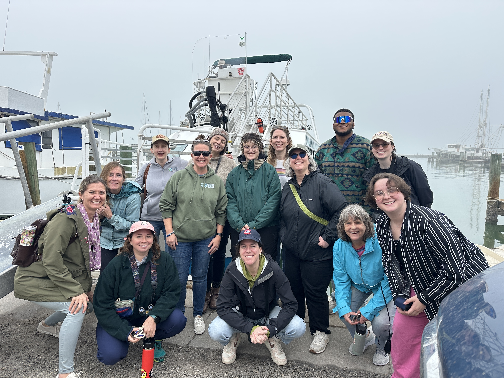

:::::::: {.column-screen .light_blue_background}
::::::: {.section-inner style="text-align: center"}
[**About Me**]{style="color:#2c3e50;font-size:3rem;"}

:::::: columns
::: {.column style="text-align: left"}
{fig-align="left" width="405"}

{fig-align="left" width="405"}
:::

:::: column
::: {.section-inner-smaller .section-inner-right style="text-align: left"}
As a Coastal Mississippi Resilience Fellow, I analyze, visualize, and communicate a wide variety of data types, including demographic, land use, hazard, and insurance-related datasets, to support planning and decision making. I have supported municipal planning, community engagement, project implementation, and have helped secure over \$6 million in state, regional, and federal grant funds for communities across southern Mississippi.

Before my fellowship, I worked as a research assistant on an NSF funded project, where I integrated structure-level datasets created by scientists with the National Center for Atmospheric Research (NCAR) and The Water Institute into a comprehensive hierarchical geospatial dataset covering nearly 1 million structures in southern Louisiana.

In August 2026, I graduated with my Ph.D. in sociology, where my research focused on inequities in flooding and disaster recovery, particularly for flood impacts that are attributable to climate change. Before this, I graduated with a M.S. from the University of North Texas in 2022 and B.S. from Texas A&M University in 2020.
:::
::::
::::::
:::::::
::::::::

:::: {.column-screen .lighter_blue_background}
::: {.section-inner .section-inner-right}
[**Research Interests**]{style="color:#B266B2;"}\
Community Resilience \| Climate Adaptation and Risk Management \| Social Vulnerability \| Housing and Insurability

[**Methods**]{style="color:#B266B2;"}\
Spatial & Quantitative Analysis \| Survey Design & Analysis \| Data Visualization & Cartography \| Vulnerability & Risk Assessment

[**Tools**]{style="color:#B266B2;"}\
R \| R Studio \| ArcGIS \| QGIS \| Google Earth Pro \| Google Colab
:::
::::

:::: {.column-screen .dark_blue_background}
::: section-inner
[**Contact**]{style="color:#FFFFFF;font-size:1.5rem"}\
[Email](mailto:larrisonkaylynn@gmail.com) • [Linkedin](www.linkedin.com/in/kaylynn-larrison-a56529169) • [GitHub](https://github.com/kaylynn-m)
:::
::::
