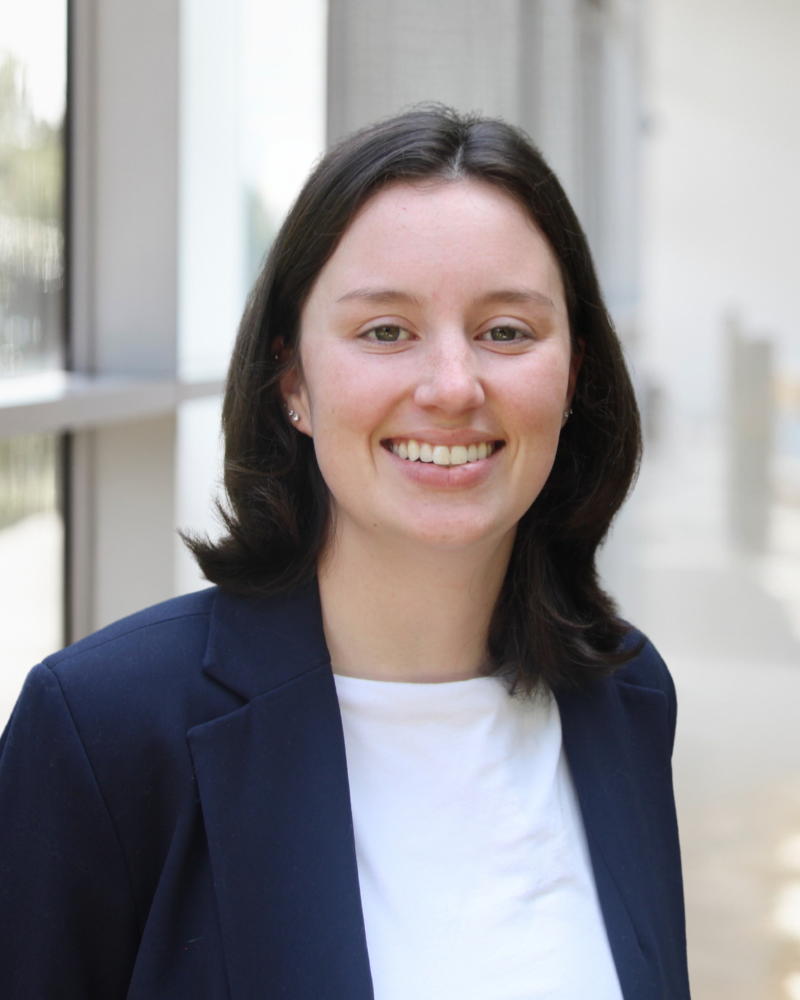

::::: column-screen
:::: hero
::: hero-box
[**KayLynn Larrison**]{style="color:#2c3e50;font-size:2rem"}\
Quantitative social scientist studying disasters, housing, and community resilience.

[Projects](projects.qmd){.hero-button}
:::
::::
:::::

:::::::: {.column-screen .light_blue_background}

::: section-inner
::::::: columns

:::: column
\
\
{width="237"}
::::

:::: column
[**About Me**]{style="color:#2c3e50; font-size: 2rem; margin-top: 3.5rem; display:inline-block;"}

Hi! My name is KayLynn, and I'm an applied researcher who studies how vulnerable communities can adapt and build resilience to changing environmental conditions. As a Resilience Fellow, I'm working with communities in coastal Mississippi to better understand their risks, identify opportunities for resilience, and turn data into actionable strategies. My work combines spatial and quantitative analysis with community engagement, with a particular focus on flooding, disaster recovery, housing, and climate adaptation.

[More About Me](about.qmd){.button}
::::

:::::::
:::

::::::::

::::: {.column-screen .lighter_blue_background}
:::: {.section-inner style="text-align: center"}
[**Recent Projects**]{style="color:#2c3e50;font-size:2rem;"}\

::: {#featured-projects .featured_projects_style}
:::

[**See All Projects**](projects.qmd){.button}
::::
:::::

<!-- :::: {.column-screen .light_blue_background} -->

<!-- ::: section-inner -->

<!-- [**Methods**]{style="color:#2c3e50; font-size: 2rem; margin-top: 3.5rem; display:inline-block;"}\ -->

<!-- R \| R Studio \| ArcGIS \| QGIS \| Google Earth Pro \| GitHub -->

<!-- ::: -->

<!-- :::: -->

:::: column-screen
::: {.section-inner style="padding-top:2rem"}
[**Let's Connect**]{style="color:#FFFFFF;font-size:1.5rem;"}\
[Email](mailto:larrisonkaylynn@gmail.com) • [Linkedin](www.linkedin.com/in/kaylynn-larrison-a56529169) • [GitHub](https://github.com/kaylynn-m)
:::
::::
