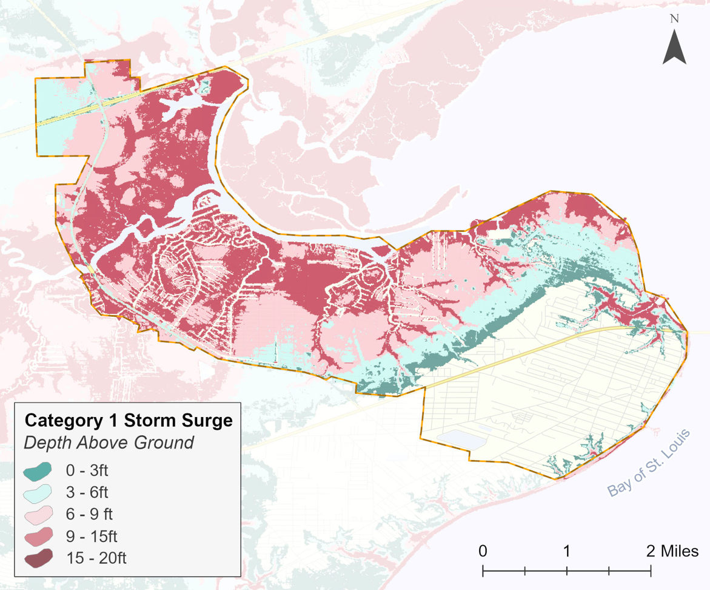
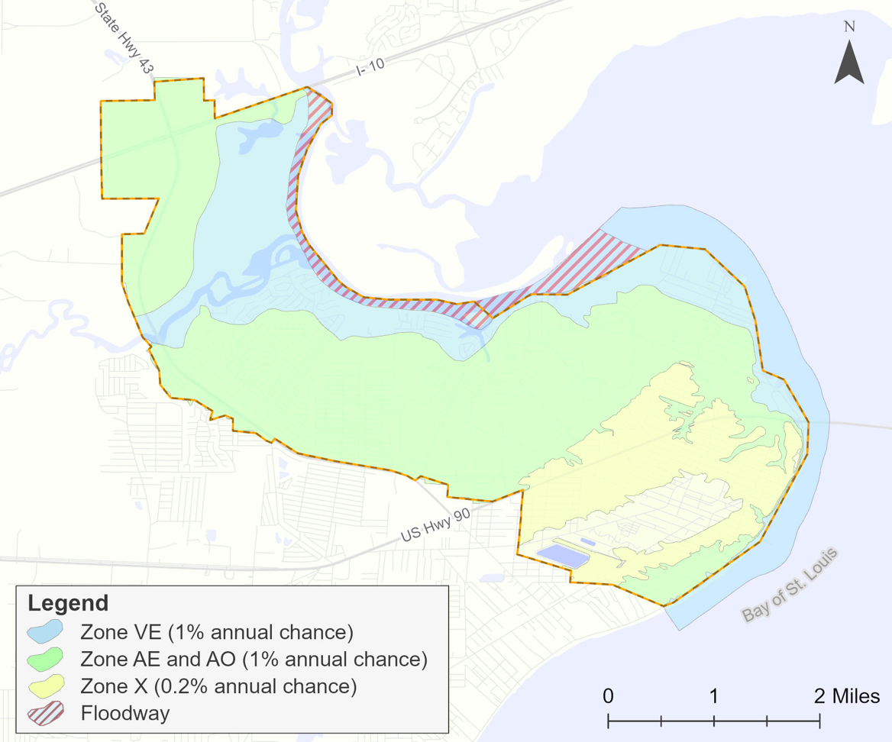

::::: columns
::: column
{width="375"}

{width="375"}
:::

::: column
# CRS Planning Support

*This project was completed using funding allocated by the Mississippi Department of Marine Resources to support coastal communities in pursuing Community Rating System (CRS) credit.*

I'm currently supporting the City of Bay St. Louis in earning credit under Community Rating System Activity 510 (floodplain management).

My work in this project includs conducting flood risk and vulnerability analyses, developing maps and other visuals, compiling and interpreting flood insurance and claims statistics, and contributing to plan writing. These analyses helped characterize local flood hazards, identify vulnerable properties and areas, and inform floodplain management priorities and mitigation strategies.

Datasets used in this project include:

-   County tax assessor data

-   NOAA sea level rise extent

-   NOAA sea level depths

-   SLOSH

-   OpenFEMA NFIP policies and claims

-   HUC watersheds
:::
:::::
