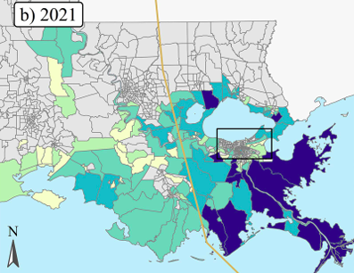

This interdisciplinary project with LSU, the National Center for Atmospheric Research, and The Water Institute examined Hurricane Ida’s impacts under changing climate conditions. I integrated modeled wind and storm-surge damage estimates with demographic data to analyze the distribution of climate-attributable impacts across communities.

::::: columns
::: column

:::

::: column
Hurricane Ida Multi-Hazard Attribution

This interdisciplinary project with LSU, the National Center for Atmospheric Research, and The Water Institute examined Hurricane Ida’s impacts under changing climate conditions. I integrated modeled wind and storm-surge damage estimates with demographic data to analyze the distribution of climate change attributable impacts across communities.
:::
:::::
