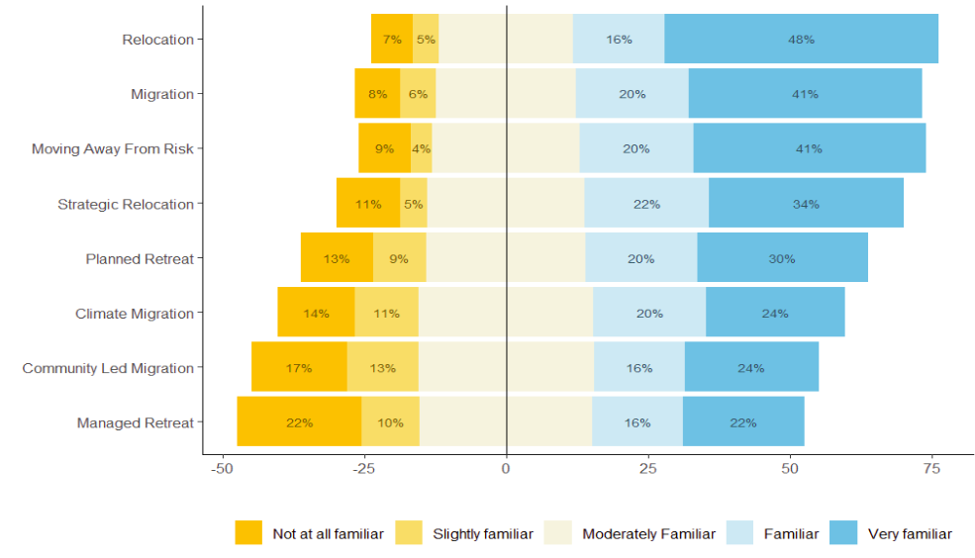

::::: columns
::: column

:::

::: column
# Migration Survey Analysis in R

I am currently analzying a gulf-wide survey with over 300 responses to evaluate preferences and perceptions of language used to describe migration away from environmentally risky places.
:::
:::::
