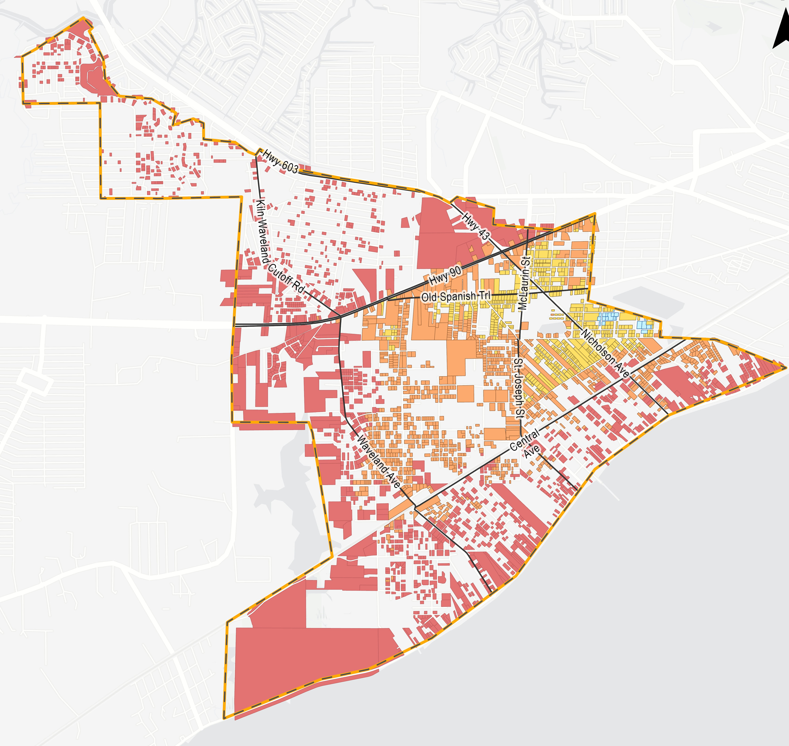

::::: columns
::: column
{width="375"}
:::

::: column
# CRS Planning Support

*This project was completed using funding allocated by the Mississippi Department of Marine Resources to support coastal communities in pursuing Community Rating System (CRS) credit.*

I contributed to the development of the City of Waveland's Community Rating System (CRS) Activity 510 floodplain management plans, supporting the technical analysis, mapping, and plan development.

My work included conducting flood risk and vulnerability analyses, developing maps and other GIS-based analyses, compiling and interpreting flood insurance and claims statistics, and contributing extensively to plan writing. These analyses helped characterize local flood hazards, identify vulnerable properties and areas, and inform floodplain management priorities and mitigation strategies.

Datasets used in this project include:

-   County tax assessor data

-   NOAA sea level rise extent

-   NOAA sea level depths

-   SLOSH

-   OpenFEMA NFIP policies and claims

-   HUC watersheds

I also supported the City's CRS planning efforts by developing a property-level database for substantial damage management planning, providing communities with an organized framework for identifying and tracking properties following flood events. For repetitive loss planning, I conducted repetitive loss area analyses to identify and characterize concentrations of repetitive flood losses and support the development of targeted mitigation actions.
:::
:::::
